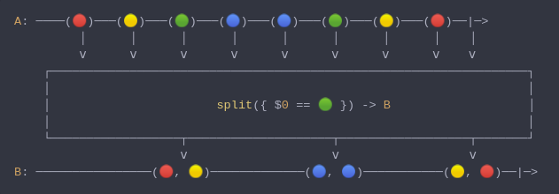

#### [CallbagKit][Callbag] › [Documentation][Documentation] › [Operators][Operators] › [Transforming][Transforming]
# Split
> A Callbag [operator][Operators] that will splits the emitted items by a separator
> and emit these splitted items as array. And it returns a [listenable][Sources] source.



<!-- ```swift
A: ────(🔴)───(🟡)───(🟢)───(🔵)───(🔵)───(🟢)───(🟡)───(🔴)──|─>
         │      │      │      │      │      │      │      │    │
         ⅴ      ⅴ      ⅴ      ⅴ      ⅴ      ⅴ      ⅴ      ⅴ    ⅴ
    ┌──────────────────────────────────────────────────────────────────┐
    │                                                                  │
    │                       split({ $0 == 🟢 }) -> B                   │
    │                                                                  │
    └──────────────────┬────────────────────┬──────────────────┬───────┘
                       ⅴ                    ⅴ                  ⅴ
B: ────────────────(🔴, 🟡)─────────────(🔵, 🔵)───────────(🟡, 🔴)──|─>
``` -->

**Examples**

```swift
  _ = from(", 1, 2, 3, 4, 5, ")
    |> split({ ", ".contains($0) })
    |> forEach(print) // ["1"]
                      // ["2"]
                      // ["3"]
                      // ["4"]
                      // ["5"]
```

```swift
  _ = from(", 12, 34, 5, ")
    |> split(", ")
    |> forEach(print) // ["1", "2"]
                      // ["3", "4"]
                      // ["5"]
```

[Callbag]: <../../../README.md> (Callbag)
[Documentation]: <../../README.md> (Documentation)
[Operators]: <../README.md> (Operators)
[Transforming]: <./README.md> (Transforming)

[Sources]: <../../Sources/README.md> (Sources)